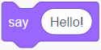
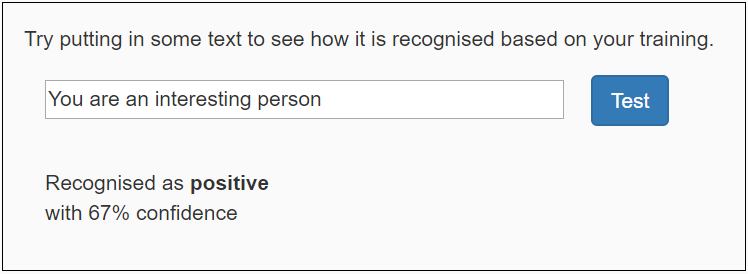
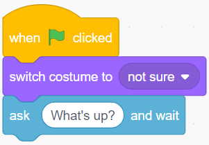
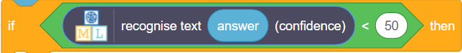

# Challenges
Complete any of the challenges below!

## Challenge 1: More Data
Add more training data to make the model even more robust!

1. Go back into the "Make me happy" project (_make sure not to close out the Scratch project_)
1. Go into the "Train" section, and add some new examples to each bucket
1. Click the "< Back to project" link in the upper left
1. Go into the "Learn & Test" section, scroll down, and click the "Train new machine learning model" button
1. Wait for the new model to train
1. When the model is trained, test it out with a few different messages
1. Switch back to the Scratch project to try out the new model in the app!

## Challenge 2: A Reply
Instead of simply changing costumes, the character should also say something depending on the message! Use the **say ...** block from the "Looks" category to accomplish this:

Place one **say ...** block under the "happy" costume switch block, still within the **if** block. Change the message to make it a proper reply to something positive, like "That makes me happy!" Place another **say ...** block under the "sad" costume switch block, and change the message so it expresses sadness.

Now, when the character hears a message, it should change the costume _and_ say something in reply!

## Challenge 3: A New Bucket
So far, the model can recognize positive things and negative things. Add a new bucket so that the model can recognize another type of message too!

Ideas for new buckets:
- Weather-related things
- Sports-related things
- Funny things
- Food-related things
- Any other type of thing that is different from positive/negative

### New Model

1. Go back into the "Make me happy" project (_make sure not to close out the Scratch project_)
1. Go into the "Train" section, and click the "**+** Add new label" button to add the new label
1. Add some examples to the new bucket
1. Click the "< Back to project" link in the upper left
1. Go into the "Learn & Test" section, scroll down, and click the "Train new machine learning model" button
1. Wait for the new model to train
1. When the model is trained, test it out with a few different messages

### Scratch Application updates

1. Switch back to the Scratch project
1. Create a new costume for the character to react to the new label
1. Under the existing code, copy one of the **if** blocks above
1. Update the new **if** block so that it so it recognizes the new label and switches to the new costume

The code should look something like this:

Test out the new program to see if the character reacts appropriately!

## Challenge 4: Working with Confidence Intervals
>Resource: [Confidence Intervals](https://machinelearningmastery.com/report-classifier-performance-confidence-intervals/)
>Resource: [Thresholding](https://developers.google.com/machine-learning/crash-course/classification/thresholding)

In machine learning, there is always a degree of uncertainty about a model's predictions. Sometimes there is very little uncertainty, and sometimes there is a lot of uncertainty. **Confidence intervals** allow developers to measure this uncertainty and act accordingly.

These confidence intervals may look familiar; they are used in the testing phase of Machine Learning for Kids models!

It is also possible to use these confidence intervals within the Scratch application.

### Updating the Scratch Application with Confidence

1. Go into the Scratch project (_make sure not to close out the Machine Learning For Kids project_)
1. Drag the blocks under the **ask** block away from the script; keep them elsewhere for later  
    
1. From the "Control" category, click and drag an **if ... then ... else** block under the **ask** block  
    
1. Drag the old code into the **else** section of the **if ... then ... else** block  
    
1. From the "Operators" category, click and drag a pointy **... < ...** block into the pointy space in the **if** block  
    
1. From the "Make me happy" category, click and drag a rounded **recognize text ... (confidence)** block into the rounded space on the left of the **... < ...** block  
    
1. From the "Sensing" category, click and drag a rounded **answer** block into the rounded "text" space in the **recognize text ... (confidence)** block  
    
1. Set the "50" in the **... < ...** block to be any desired confidence interval
    - For example, if it were 70, the model would be "not sure" if its confidence interval was 70 or lower
1. From the "Looks" category, click and drag a **say ...** block into the top **if** block
1. Update the text in the new **say ...** block to say that the character is not sure how to feel  
    
1. Run the program to test how it works!

Go back and adjust the confidence interval in the code if necessary. 

## Challenge 5: Other Worksheets
There are [several worksheets](https://machinelearningforkids.co.uk/#!/worksheets) available online for the Machine Learning For Kids platform. Feel free to try any of them that look interesting!

### Beginner
These worksheets are a little simpler:

- [Shy Panda](https://github.com/IBM/taxinomitis-docs/raw/master/project-worksheets/pdf/worksheet-shypanda.pdf): Make a dancing panda that gets shy and stops dancing if it sees you looking.
- [Car or Cup](https://github.com/IBM/taxinomitis-docs/raw/master/project-worksheets/pdf/worksheet-carorcup.pdf): Train the computer to be able to sort photos into groups.

### Intermediate
This worksheet is a little more complex:

- [Judge a Book](https://github.com/IBM/taxinomitis-docs/raw/master/project-worksheets/pdf/worksheet-judgeabook-easy.pdf): Create a model to recognize the genre of books based on their cover art.
