# Machine Learning For Kids - Simple Sentiment Analysis
The goal of this activity is to build a simple Scratch program that can tell if a review is 5 stars or 1 star. The character in the program will react happily if the review is 5 stars, and sadly if the review is 1 star. This will show how machine learning models are used to build applications. This involves collecting data, training the model, and finally, creating an application that uses the model.

>This is an adaptation of the ["Make me happy" worksheet](https://github.com/IBM/taxinomitis-docs/raw/master/project-worksheets/pdf/worksheet-makemehappy-easy.pdf) from _Machine Learning For Kids_.

## Part 1: Creating a _Machine Learning For Kids_ Project
The first step is to create a new project using _Machine Learning For Kids_. _Machine Learning For Kids_ is a web-based educational tool that allows students to train machine learning models and build applications that use those models. It provides a user-friendly interface, so developers do not need to know what happens behind the scenes.

1. Open a web browser and go to [machinelearningforkids.co.uk](https://machinelearningforkids.co.uk)
1. Click on the "Get started" button  
    
1. Click on the "Try it now" button  
    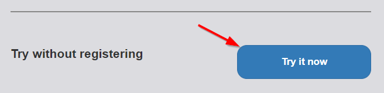
1. Click on the "**+** Add a new project" button  
    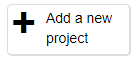
1. Fill out a name for the project: "Oreo Reviews"
1. Click the "Recognising" dropdown and select "text"
1. Click the "Create" button  
    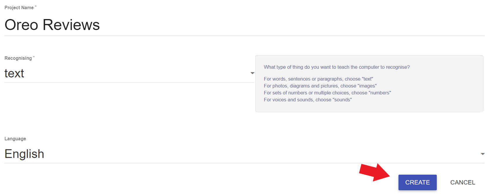
1. Check to make sure the project now appears in the list!  

## Part 2: Training a New Machine Learning Model
The next step is to create an actual machine learning model. This model will recognize text as 5 stars or 1 star based on example data that is classified as such. We will be classifying [Oreo reviews](https://www.amazon.com/Double-Chocolate-Sandwich-Cookies-Resealable/dp/B078PH27HZ/ref=sr_1_1_sspa?crid=X9W9FC0Q7XIO&keywords=oreo&qid=1657137939&sprefix=oreo%2Caps%2C205&sr=8-1-spons&spLa=ZW5jcnlwdGVkUXVhbGlmaWVyPUEyWUNRWEU1SDFXM1hQJmVuY3J5cHRlZElkPUEwMTk5NjI5MjlRSlJSTzc3TDEzJmVuY3J5cHRlZEFkSWQ9QTA1NjIwMzgyQzczSExBOUQzMFJKJndpZGdldE5hbWU9c3BfYXRmJmFjdGlvbj1jbGlja1JlZGlyZWN0JmRvTm90TG9nQ2xpY2s9dHJ1ZQ&th=1) today!

This type of learning is known as _supervised learning_ because the examples are labeled. The computer will learn from patterns in these examples, like word choice, sentence structure, and more.

1. Click on the new "Oreo Reviews" project from the list  
    
1. Click on the "Train" button  
    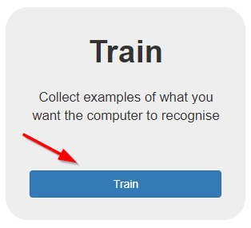
1. Click on the "**+** Add a new label" button  
    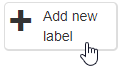
1. Enter "5 star reviews" and click the "Add" button to create a "5_star_reviews" bucket
1. Repeat the steps above to create a "1 star reviews" bucket as well
1. Use the "**+** Add example" button in the "5_star_reviews" bucket to add at least **six** 5 star Oreo reviews  
    - [Copy and Paste 5 star reviews from here](https://www.amazon.com/Double-Chocolate-Sandwich-Cookies-Resealable/product-reviews/B078PH27HZ/ref=cm_cr_unknown?ie=UTF8&reviewerType=all_reviews&filterByStar=five_star&pageNumber=1)  
    
1. Similarly, use the "**+** Add example" button in the "1_star_review" bucket to add at least six **1 star Oreo** reviews  
    - [Copy and Paste 1 star reviews from here](https://www.amazon.com/Double-Chocolate-Sandwich-Cookies-Resealable/product-reviews/B078PH27HZ/ref=cm_cr_unknown?ie=UTF8&reviewerType=all_reviews&filterByStar=one_star&pageNumber=1)  
1. Once each bucket is full, click the "< Back to project" link in the upper left to go back to the main project page  
    
1. On the main project page, click on the "Learn & Test" button  
    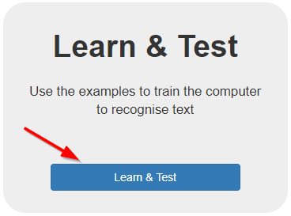
1. On the models page, click the "Train new machine learning model" button  
    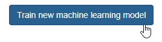
1. Wait a few minutes for the training to complete - feel free to answer the quiz questions during this time
1. When the training is done, enter some other reviews from the [Oreo page](https://www.amazon.com/product-reviews/B078PH27HZ/) and test them out - see how the computer does at recognizing the text!  
    

After testing the model, feel free to go back and add more examples to the "5_star_reviews" and "1_star_reviews" buckets. More data with more variation will make the model even better at recognizing the text! Try to add examples of different lengths, and make sure the total number of examples in the "5_star_reviews" and "1_star_reviews" buckets are about equal. After adding more examples, make sure to re-train the model.

## Part 3: Making an Application with the Model
Now that the model is trained and ready to go, it's time to use it in a _Scratch 3_ application! _Scratch_ is a block-based programming language. Programmers can create sprite characters, and drag and drop blocks to create scripts for the sprites.

### Setting up Scratch
First, get into Scratch and create a character for the application.

1. Click the "< Back to Project" link to go back to the main project page
1. From there, click the "Make" button  
    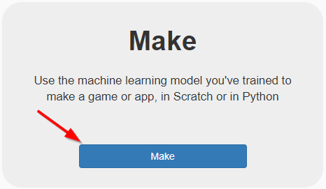
1. Click the "Scratch 3" button to see the Scratch 3 instructions
1. Click the "Open in Scratch 3" button to open Scratch with the machine learning model blocks  
    
1. In the Sprites area on the bottom right side, click the trash can icon to delete the cat sprite  
    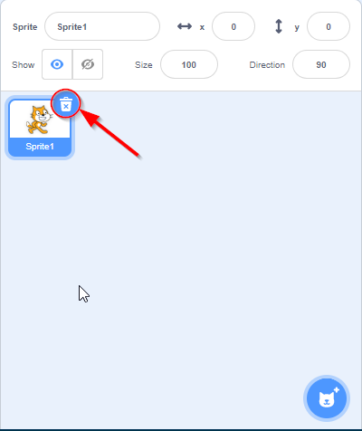
1. From the Sprites area, hover over the new sprite icon and select the paintbrush to paint a new sprite  
    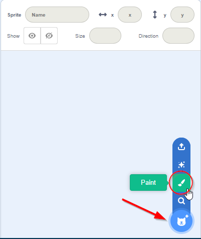
1. Draw a character appearing neutral (not happy or sad), and name the costume "neutral"  
    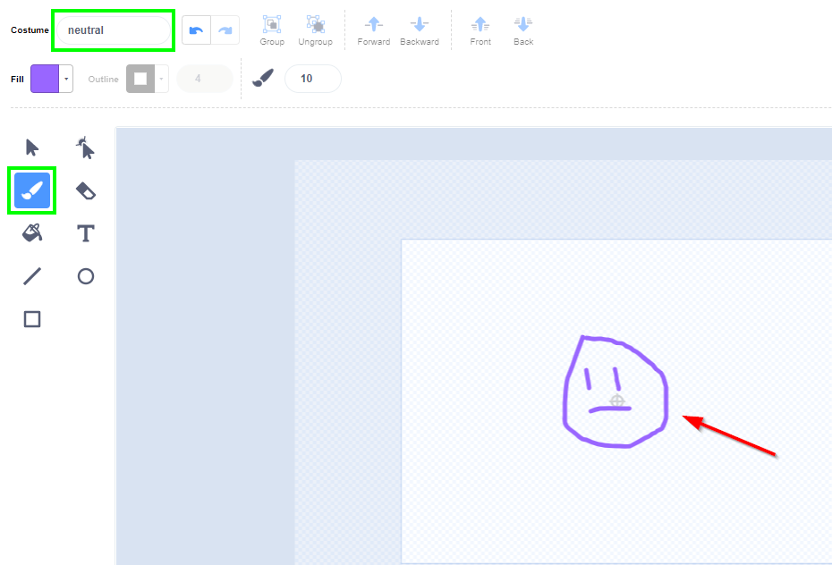
1. On the left side of the screen, right click the "neutral" costume and select "duplicate"  
    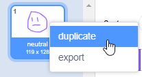
1. Adjust the character's drawing so they are happy, and rename the duplicated costume to "happy"
1. Duplicate the original costume again, and make a "sad" costume  

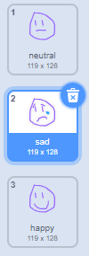

### Adding Intro Code
Add some code to make the character ask a question!

1. Near the top of the page, click on the "Code" tab  
    
1. From the "Events" category, click and drag a **when {green flag} clicked** block to the middle of the screen
1. From the "Looks" category, click and drag a **switch costume to ...** block under the **when {green flag} clicked** block
    - The blocks should snap together when connected
1. In the **switch costume to ...** block, click the down triangle and make sure "neutral" is selected
1. From the "Sensing" category, click and drag an **ask ... and wait** block under the **switch costume to...** block
1. In the **ask ... and wait** block, change the question text to say "What's up?"
1. Run the program by clicking the green flag above the stage on the right, and see how it asks the question

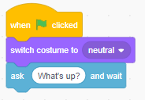

### Using the Machine Learning Model
The next step is to use the trained model to figure out how the character should react to the message. If the model recognizes the text as positive, the character should switch to the happy costume. Otherwise, if the model recognizes the text as negative, the character should switch to the sad costume.

1. From the "Control" category, click and drag an **if ... then** block under the **ask ... and wait** block
1. From the "Operators" category, click and drag a pointy **... = ...** block _into_ the pointy space in the **if ... then** block
1. From the special "Oreo Reviews" ML4K category, click and drag a **recognise text ... (label)** block into one side of the **... = ...** block
    - Make sure to click the left part of the block to be able to place it
1. From the "Sensing" category, click and drag a rounded **answer** block into the round space in the **recognise text ... (label)** block
1. From the "Oreo Reviews" category, click and drag a rounded **5_star_reviews** block into the other side of the **... = ...** block
    - This **if ... then** block will now check whether the model recognizes the message as a positive thing
1. From the "Looks" category, click and drag a **switch costume to ...** block into the **if ... then** block so it is sandwiched within it
1. Click the dropdown on the **switch costume to ...** block to change the costume to "happy"
1. Run the program by clicking the green flag, and make sure entering 5 star reviews makes the character happy
1. Below the existing **if ... then** block, add another **if ... then** block that will recognize 1 star reviews
1. Within the new **if ... then** block, use a **switch costume to ...** block to make the character sad
1. Run the program again, and see what it is able to recognize as 5 or 1 star reviews!

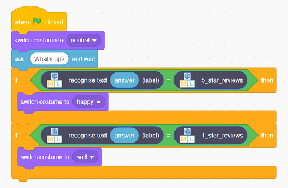

## Saving the Scratch Project
On the top bar of the Scratch site, on the left side, select "File" -> "Save to your computer" to save the project!

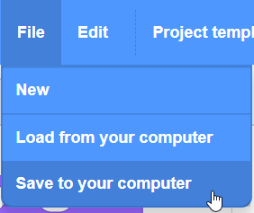