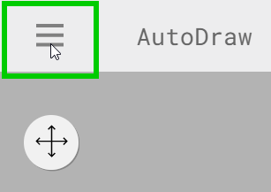
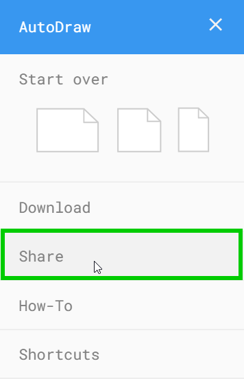
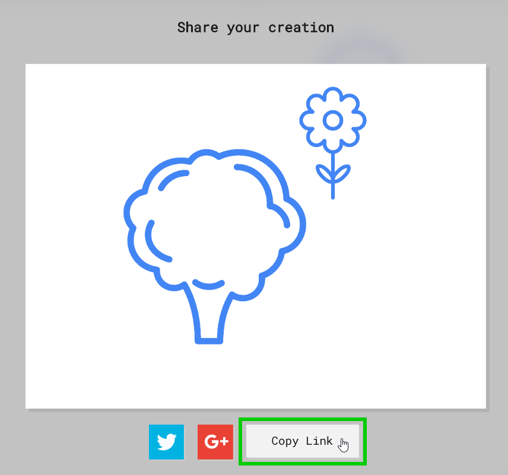

# Icebreaker - AutoDraw
For this icebreaker activity, draw a picture using artificial intelligence!

## Start Drawing
Follow these steps to start drawing.

1. Go to AutoDraw: [https://www.autodraw.com/](https://www.autodraw.com/)
    - If there is a canvas with a drawing, click the hamburger menu in the upper left and select one of the blank canvases under "Start over"
    - If there is no canvas, click the "Start Drawing" button
1. With the "AutoDraw" pencil selected, start drawing something
1. The A.I. should start to guess the drawing - check the top bar for suggestions!
1. Play around with the drawing until you create something good
    - Select different tools
    - Change the colors
    - Draw multiple objects

Feel free to create anything you'd like!

## Sharing
When you're ready to share, follow these steps.

1. Click the Hamburger menu in the upper left  
    
1. Select the "Share" option  
    
1. Click the "Copy Link" button  
    
1. Open the submission form: [https://forms.gle/3fD69RyN92hq6GBHA](https://forms.gle/3fD69RyN92hq6GBHA)
1. On the form, select your room, enter your name, and paste in your link with **Ctrl**+**v** or right click -> "Paste"
1. Submit the form to send your drawing!